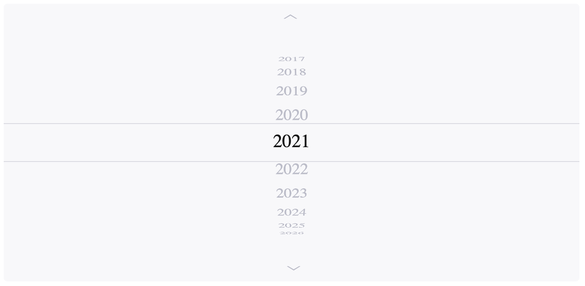

# Vue Wheel Picker

Picker is a Vue component that selects a value from the list by dragging the cylinder allowing users to experience the rolling effect.

User can change Picker's value in several ways:
* Drag the wheel (supports acceleration)
* Use mobile touch moves
* Click on the arrows to roll one element up or down
* Use mouse wheel or touchpad
* Use up or down arrows on the keyboard when the Picker is focused



You can try the Picker with different properties passed to it in the prepared playground: https://picker.vanishmax.com/

## Installation

**NPM**. You can install Picker in different ways. The best one is through NPM:

```bash
npm i vue-wheel-picker
```

Then, import the Picker to your app and use it:

```html
<template>
  <div>
    <Picker :options="years" v-model="currentYear" />
  </div>
</template>

<script>
  import Vue from 'vue'
  import Picker from 'vue-wheel-picker';
  
  function getYears () {
    const currentYear = new Date().getFullYear();
    const years = [];
    
    for (let i = currentYear - 20; i < currentYear + 20; i++) {
      years.push({
        value: i.toString(),
        text: i.toString(),
      });
    }
    
    return years;
  }
  
  export default Vue.extend({
    components: {
      Picker,
    },
    data () {
      const current = (new Date().getFullYear()).toString();
      return {
        years: getYears(),
        currentYear: {
          value: current,
          text: current,
        },
      };
    },
  });
</script>

<style>
  .picker {
    display: flex;
    flex-direction: column;
    justify-content: space-between;
    align-items: center;
    
    max-width: 80%;
    height: 300px;
    margin: 16px auto 0;
    background-color: #F8F8FA;
    border-radius: 4px;
    
    text-align: center;
    font-size: 18px;
    color: #bbbcc9;
  }
  
  .picker_chosen {
    background-color: #F8F8FA;
    border-top: 1px solid #dddde4;
    border-bottom: 1px solid #dddde4;
    color: #121212;
    font-size: 20px;
  }
</style>
```

Here we've added *styles* to demonstrate that the Picker carries only most 
needed styles in itself. It includes 3D styling, positioning and focus handlers, 
so you need to add only sizes and colors. Therefore, the Picker will surely suit your project!

**UNPKG**. Alternatively, you can add component to any HTML file via UNPKG:

```html
<!DOCTYPE html>
<html lang="en">
<head>...</head>
<body>
<div id="app">
  <picker />
</div>

<!-- Import Vue and Picker from UNPKG CDN -->
<script src="https://unpkg.com/vue/dist/vue.js"></script>
<script src="https://unpkg.com/vue-wheel-picker"></script>

<!-- Initialize Vue app -->
<script>
  Vue.component('picker', Picker);
  
  new Vue({
    el: '#app',
  })
</script>
</body>
</html>
```

## Properties

| Prop name            |               Type              |  Default | Description                                                                                                                                                                                           |
|----------------------|:-------------------------------:|:--------:|-------------------------------------------------------------------------------------------------------------------------------------------------------------------------------------------------------|
| options              |          array of value         |    `[]`    | An array of options in format { value: string, text: string } to be displayed in the Picker                                                                                                           |
| value                | { value: string, text: string } |   `null`   | Default value of the Picker. Use either as initial value or as a v-model                                                                                                                              |
| radius               |              number             |    `150`   | How far is each item in the list from another                                                                                                                                                         |
| perspective          |              number             |    `200`   | Defines 'how far is the Picker from the viewer'. Visually changes the circless-ness of the Picker                                                                                                     |
| itemHeight           |              number             |    `40`    | The height of each item in the list. Needed to properly calculate the position of them                                                                                                                |
| sensitivity          |              number             |     `8`    | How sensible is Picker for touches. The bigger value you put the more acceleration the Picker gains after moving the touch. Must be in the range from 0 to 10.                                        |
| visibleOptionsAmount |              number             |    `10`    | Amount of options that are visible on the ring of a Picker. At maximum, will display passed amount plus one chosen option in the center of the ring. Must be a multiple of 2 for the best experience. |
| type                 |      'normal' or 'infinite'     | `'normal'` | **Not supported yet!** If 'infinite' is passed, then you can scroll the Picker forever, all values will repeat                                                                                            |
| arrows               |             boolean             |   `false`  | Whether the arrows for scrolling to top or to bottom are needed to be displayed                                                                                                                       |

## Arrows

There is a built-in support for vertical arrows which pick the next or the previous value in the Picker. To use them, pass the property `arrows` to the component and add 2 slots like this:
```html
<Picker arrows>
  <template #arrow-top>⟨</template>
  <template #arrow-bottom>⟨</template>
</Picker>

<style>
  .picker_arrow {
    font-size: 18px;
    height: 20px;
    width: 24px;
    padding: 4px;
    margin: 0 auto;
  }
  
  .picker_arrow.top {
    transform: rotate(90deg);
  }
  
  .picker_arrow.bottom {
    transform: rotate(-90deg);
  }
</style>
```

The flexibility of such approach is that you can put any utf character, or SVG icon or 
an image there and apply whatever style you like, but the click event is a responsibility of the Picker itself. 

## Copyright

Licensed by the terms of <a href="https://github.com/VanishMax/picker/blob/main/LICENSE" target="_blank" rel="noreferrer noopener">MIT license</a>. 
Copyright © <a href="https://github.com/VanishMax" target="_blank" rel="noreferrer noopener">VanishMax</a>. 2021
